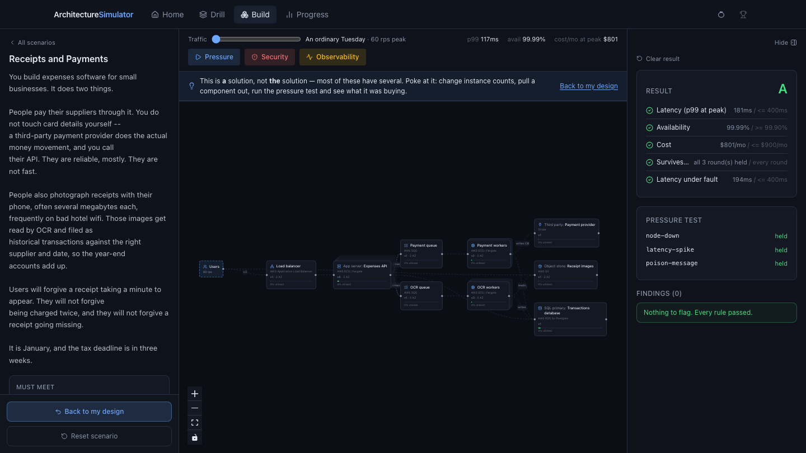
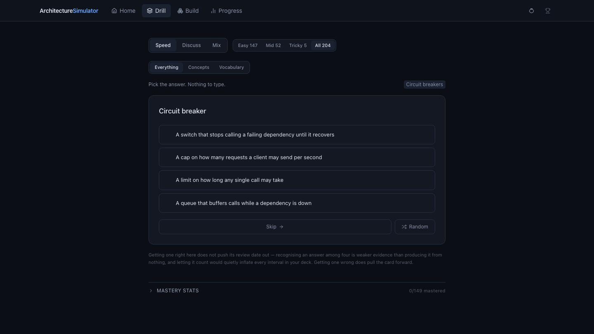

<h1 align="center">Architecture Simulator</h1>

<p align="center">
  <strong>Learn system architecture by defending it.</strong><br>
  Design a system for a scenario, then turn the traffic up and start breaking things.
</p>

<p align="center">
  <a href="https://architecture-simulator-five.vercel.app"><strong>Live app →</strong></a>
  &nbsp;·&nbsp;
  <a href="SPEC.md">Design notes</a>
  &nbsp;·&nbsp;
  
</p>

<p align="center">
  
</p>

---

## What it is

Interview prep for system design that makes you _produce_ answers rather than recognise them.

**Build** gives you a scenario with hard requirements — p99 under 400ms, 99.9% available, under $900 a month — and a scoped palette. Drag components out, wire them together, then attack the result: raise the traffic, kill a node, flush the cache, poison a queue, run a security probe. You get a grade and a list of findings.

**Drill** is the recall half: 204 cards across 166 topics, in multiple choice for volume or typed-answer for the real thing, on an SM-2 schedule.

**The loop is the product.** Fail a rule in Build and the matching cards land at the front of tomorrow's Drill queue.

<p align="center">
  
</p>

## The part worth reading

If you're skimming this as a hiring signal, these are the decisions I'd defend in an interview.

**The engine is pure.** `simulate(graph, load, faults) → { metrics, verdicts }` touches no React, no network, no database. Every number on screen is a render of a function that can be tested at a keyboard. The queueing maths is a deliberate game heuristic — `ρ = λ/μ`, latency inflated by `1/(1−ρ)` and clamped — and it says so in the code, because a model that quietly pretends to be queueing theory teaches the wrong lesson twice.

**Types make a class of bug impossible.** `TopicId` is `keyof typeof TOPICS`, not `string`. A typo in a rule's `topicIds` is a compile error rather than a feedback loop that silently never fires. Same trick for scenarios, components and rules.

**CI proves the scenarios are winnable.** Every scenario ships a reference solution, and a test grades it through the real engine and asserts every requirement still passes once it is drawn on the canvas — because the picture on screen has to be the thing CI verified, not a tidier cousin of it. Rebalance a component's capacity and break a level, and the build fails before a human notices it's unbeatable. A coverage ratchet does the same for the deck: add a topic without a card and CI goes red.

**The tests match the failure mode.** Component tests run in happy-dom, which cannot catch a stale build cache serving an empty stylesheet, a canvas with zero height, or drag-and-drop that never fires — all three of which actually happened. So the things only a browser can catch are checked in a real one (`pnpm smoke`), and the pure logic is checked where it's fast.

**Measurement is honest about what it can't see.** A correct Speed answer never pushes a review date out: recognising one answer among four is weaker evidence than producing it from nothing, and letting it count would inflate every interval in the deck. A card counts as learned only once it's been graded in Drill, not when a multiple-choice guess landed.

**Where the model disagrees with intuition, it's written down.** Routers divide traffic across their outgoing edges; callers duplicate it. Availability is `1 − (1−a)^domains`. Cost is graded at peak load, not at the slider's current position, so sizing for peak isn't punished as over-provisioning on a quiet Tuesday. The reasoning lives in [`SPEC.md`](SPEC.md).

## Stack

Next.js 15 (App Router) · React 19 · TypeScript (strict, `noUncheckedIndexedAccess`) · Tailwind v4 · `@xyflow/react` · vitest · Playwright · pnpm · Vercel.

**242 tests.** No accounts, no API keys, no backend — progress lives in browser storage behind a `ProgressStore` interface, with a Firestore implementation a swap away.

## Run it

```bash
pnpm install
pnpm dev          # http://localhost:3000
```

No configuration of any kind.

```bash
pnpm check        # typecheck + tests, what CI runs
pnpm test         # watch mode
pnpm build        # production build, exactly as Vercel runs it
pnpm build:local  # same, but writes to .next-build so a live dev server survives
pnpm smoke        # real-browser test (needs `pnpm dev` in another terminal)
```

<details>
<summary><strong>Where things live</strong></summary>

<br>

| Path                       | What                                                                                |
| -------------------------- | ----------------------------------------------------------------------------------- |
| `SPEC.md`                  | The plan, and the reasoning behind every design decision                            |
| `src/topics.ts`            | The shared taxonomy. `TopicId` is a union, not `string` — a typo is a compile error |
| `src/sim/simulate.ts`      | The engine. Flow propagation, latency, availability, cost                           |
| `src/sim/rules.ts`         | The 34 rules that produce findings, each tagged with the topics it teaches          |
| `src/sim/scenarios/`       | Scenario data plus each one's reference solution                                    |
| `src/sim/observability.ts` | The observability probe — findings derived by comparing fault rounds to baseline    |
| `src/drill/`               | Cards, SM-2 scheduling, queue policy, progress                                      |
| `src/drill/cards/`         | The deck, one module per domain so a card is reviewable in a PR                     |
| `src/storage/`             | `ProgressStore` — local today, Firestore when you want it                           |

</details>

<details>
<summary><strong>Gotchas</strong></summary>

<br>

**Use `pnpm build:local` if `pnpm dev` is running.** A plain `next build` writes to `.next` and replaces the dev server's cache underneath it, leaving the running app 404ing on `layout.css`. `build` itself is deliberately plain, because Vercel runs it and expects output in `.next`.

**If a page hangs on "Loading deck…" or loses its styling**, the dev cache is stale — installing a dependency while the dev server runs will do it:

```bash
rm -rf .next && pnpm dev   # then hard-refresh (⌘⇧R)
```

**Progress is per browser.** [`docs/FIRESTORE_SETUP.md`](docs/FIRESTORE_SETUP.md) is a ~20 minute walkthrough to sync it across devices. Until then the app needs no setup at all, which is the trade being made deliberately.

</details>

## Licence

MIT — see [LICENSE](LICENSE). Fork it and make it your own.

Free and ad-free. If it helped, [buy me a coffee](https://ko-fi.com/timmday).
